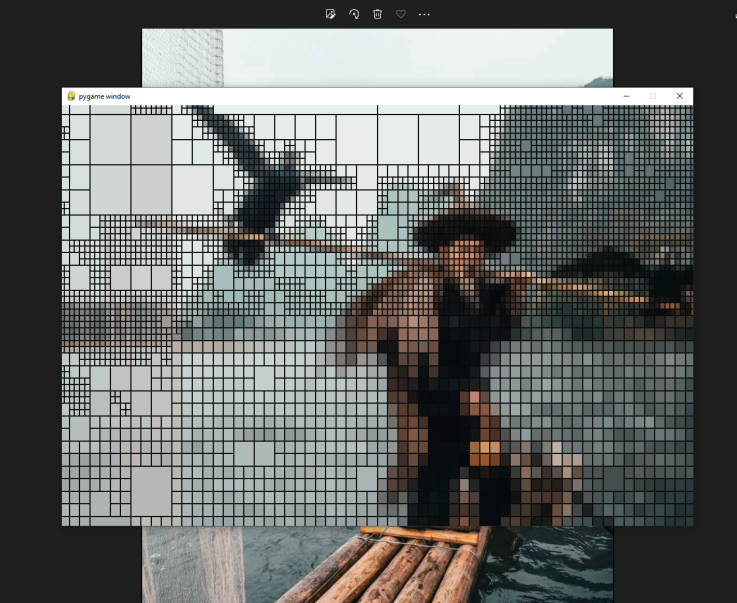

# Quadtree Image Compression

python (3.10.8)  
pygame (2.1.2)  
numpy (1.23.4)  
PIL (9.2.0)

<p align="center">
  
</p>
<h6 align="center"><i> Image of Chiaki Sato. Taken from https://woman.excite.co.jp/article/lifestyle/rid_AnanNews_2458/. </i></h6>
<br><br>
<p align="center">
  
</p>
<h6 align="center"><i> Image by Peter Yan. Website: https://www.peteryanstudio.com/. </i></h6>

Performs a quadtree decomposition algorithm using a given image. A folder is created stamped with the time of creation, loaded with images at every depth of the decomposition process. A gif representing it is made at the end.

## Running

Install Python given your OS. Be sure to add it to PATH. In Windows, this is a checkbox at the 'successfully installed' screen of the setup wizard.

```bash
py -m pip install -r requirements.txt
```

Then, run the following command in your terminal:

```bash
py main.py
```

If `py` does not work, try `python`, `python3` or the directory link to your Python executable if the Python folder is not added to PATH.

## Controls

There is no GUI for manipulating the controls. Instead, you are asked to rely on the comments in the code. 

You can change what file is to be used, the error threshold, max depth, etc.

## Limitations

Images of high dimensions will lead to a memory error. This is because average colors of groups of pixels are prefixed. I am not aware of the limit, as I have only tested this on a 2560x1440 image, which worked fine, and a 6500x6000 image, which did not.

For certain images, the image with the highest possible depth may be slightly bigger than the actual filesize. Not certain why this happens, nor do I have much control over it with this implementation as the serialization of the image into a file is handled by PyGame. Nevertheless, the compression works fine otherwise.

## Other Stuff

The color of a node is the average color of all the pixels it encompasses. Upon building the image, the color of a node is queried from a prefixed dictionary, generated upon startup. This dictionary is not very space-efficient as it contains data for every possible node that can be generated by the quadtree, hence a memory error for large sizes.

Error is computed using the average of average manhattan distance of the color of each child to the color of its parent, taken as a float. This is more performant than using euclidean distance, for the same result.  
